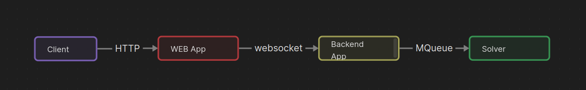

## POC HB Communitation
#####Minimalistic of How the Communication Will Flow Between be-sqs-solver (beside the RESTFul).


### Project Structure:

```.
.
├── definitions.json # RabbitMQ User Settings
├── deploy # BE and Solver containers
│   ├── Dockerfile.be
│   └── Dockerfile.solver
├── docker-compose.yml
├── image.png
├── poetry.lock
├── pyproject.toml
├── README.md
├── src # Simulates Backend and Solver
│   ├── be.py
│   └── solver.py
├── web # Simulates Front End
│   ├── index.js
│   ├── package.json
│   └── package-lock.json
└── web.py
```

### How to Run: 
####On the main dir, execute: 

`docker-compose up --build`

####Once it's up and running access one of the web clients:
`poetry run python web.py`

#####OR

`cd web`
`npm install`
`npm run dev`

### If you are using the web client as a web application (The nodejs one):

```
curl --request POST \
  --url http://localhost:3000/send-message \
  --header 'Content-Type: application/json' \
  --header 'User-Agent: insomnia/8.6.1' \
  --data '{"message":"My Message!"}'
  ```

#### Expected response: 
```
{
	"success": true,
	"message": "Message sent successfully"
}
```



#### More information: 

Feel free to access the management tool for RabbitMQ on `http://localhost:1672`

`admin:password`

You can find some usefull information there.